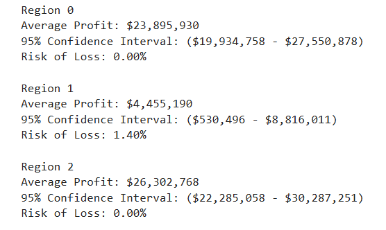
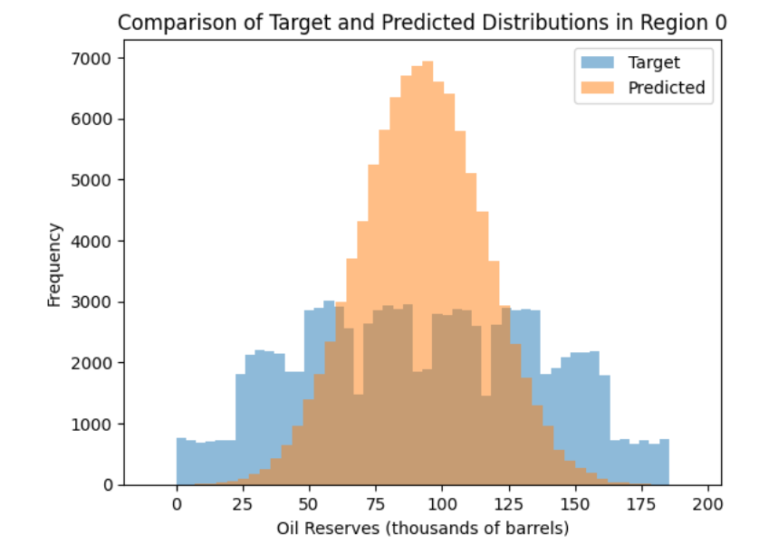

# Sprint 9 Project: Machine Learning in Business
 
---

### 📚 Table of Contents
- 🔍 [Project Overview](#project-overview)
- 📈 [Conclusion](#conclusion)
- 🖼️ [Sample Outputs](#sample-outputs)
- 📁 [Files](#files)

---

## Project Overview

You work for the OilyGiant mining company. Your task is to find the best place for a new well.

Steps to choose the location:
- Collect the oil well parameters in the selected region: oil quality and volume of reserves;
- Build a model for predicting the volume of reserves in the new wells;
- Pick the oil wells with the highest estimated values;
- Pick the region with the highest total profit for the selected oil wells.

You have data on oil samples from three regions. Parameters of each oil well in the region are already known. Build a model that will help to pick the region with the highest profit margin. Analyze potential profit and risks using the Bootstrapping technique.

---

## Conclusion

This project aims to train a model to help suggest a region for the development of oil wells by the OilyGiant mining company. I imported and prepared the data, trained models to predict oil reserves for mines in each region, calculated the likely profit for each region, and employed bootstrapping to estimate the risk of nonprofits.

Some of the features and targets have unusual distributions. The targets for all regions are far from normal and those for region 1 are discrete and extremely restricted in range. Something unique about region 1 makes it different from the others and affects model performance. The linear regression model for region 1 is almost perfect (R^2 = 1) but those for region 0 (R^2 = 0.28) and region 2 (R^2 = 0.21) are quite poor.

Given the business conditions and costs of doing business, only wells with reserves greater than 111 units (thousands of barrels) turn a profit. That is more than the average reserves in any of the regions, but profits are only derived from the top 200 wells in a sample of 500 taken in each region. The average predicted reserves in the top 200 wells surpasses the 111-unit threshold in every region with the best being region 0 (163.22 units). Profitability should not be a problem.

Estimating profits for the top 200 reserves in each region confirms that region 1 is roughly half as profitable as the other two regions. Estimations using targets (actual reported data) are on the order of twice as large as those using model predictions for regions 0 and 2 but not for region 1. That is explained by the far superior performance of the model for region 1, which is much less likely to underestimate reserves. Whereas region 2 is the most profitable ($71 million) using targets, region 0 is the most profitable ($47 million) using predictions. The model diverges from reality.

Confidence intervals estimated with bootstrapping reveal risks of financial losses well below the project threshold of 2.5% for all three regions. The only question is which region is likely to be the most profitable. Surprisingly, region 1 has the highest average predicted profit ($4.42 million) according to the bootstrapped estimates. That contradicts all the previous analyses, which consistently found region 1 with the least reserves and profits.

Comparing bootstrapped profit estimates using targets instead of predictions drastically changes the results. Using targets, region 1 is once again the least profitable region by a large measure. Region 2 is the most profitable with $26.30 million, nearly six times the profit of region 1 ($4.46 million). Using targets instead of predictions affects regions 0 and 2 much more than region 1 because of those quirks in its distribution discussed earlier. Although the near-perfect linear regression model for region 1 produces very accurate predictions, those for regions 0 and 2 are quite inaccurate and narrow the distributions considerably. Such narrow distributions systematically underestimate the upper tail, including the top 200 wells used for the profit calculation. The best predicted wells are less lucrative than the best target wells. That dynamic is exacerbated by bootstrapping, which eliminates most of the upper tail, and the profit formula itself. All those factors add up to greatly underestimate the profitability of wells in regions 0 and 2 but not in region 1.

This project offers a great lesson about the perils of modeling. Models can be extremely effective or not, depending on various factors. Relying on poorly performing models can lead to misunderstandings and bad decisions. If I were to base my recommendation to OilyGiant on the results of the models, I would have to select region 1 for further development. There are warning signs from earlier analyses that conflict with the final result, but the bootstrapped estimates clearly favor region 1. Having done the analysis using targets instead of predictions, I know that recommending region 1 is a mistake. It is reliably profitable but by far the least lucrative region. Regions 0 and 2 would both be much better recommendations, with region 2 the ultimate victor. I suppose the lesson is to try several different analyses, look for inconsistencies, and be wary of poorly fitting models or suspicious distributions.

---

## Sample Outputs

Here are two key moments from the analysis:

  
*Average profit, 95% confidence interval, and risk of loss by region. Region 2 offers the highest expected profit with minimal risk.*

 

  
*Predicted oil reserves in Region 0 are more tightly clustered than the actual values, indicating some bias in the model’s estimates.*

---

## Files

📄 See the full analysis in [`sprint-09-project.ipynb`](./sprint-09-project.ipynb)  
📄 Or view a static version in [`sprint-09-project.html`](./sprint-09-project.html)  
📄 Project background: [`project-description.md`](./project-description.md)

> Note: This project uses three CSV files, all of which are included in the `/data/` folder.  
> See [`/data/README.md`](./data/README.md) for details.
